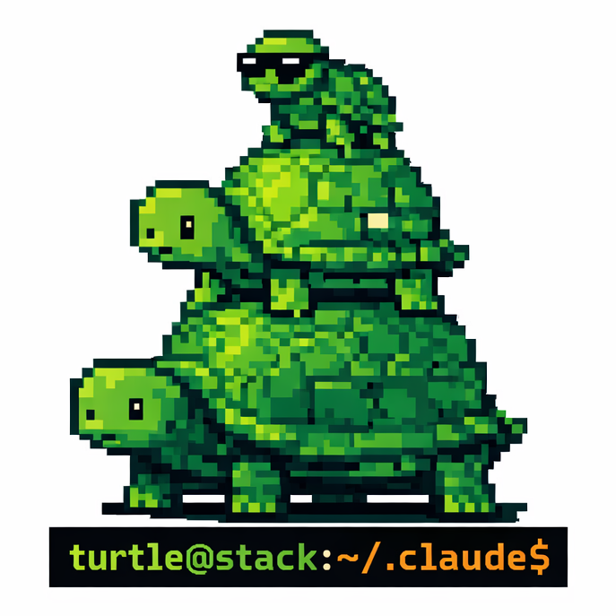

# Turtlestack

A plugin marketplace for sharing Claude Code agents, skills, rules, and configurations across your team.

<p align="center">
  
</p>

- [Quick start](#quick-start)
- [Thinking skills](#thinking-skills--the-core-of-the-marketplace)
- [Agent overview](#agent-overview)
- [All plugins](#all-plugins)
- [How it works](#how-it-works)
- [Evaluation framework](#evaluation-framework)
- [Troubleshooting](#troubleshooting)
- [Creating a new plugin](#creating-a-new-plugin)
- [Customization](#customization)
- [Complementary plugins](#complementary-plugins)
- [Acknowledgements](#acknowledgements)

## Quick start

### 1. Add the marketplace

```
/plugin marketplace add hpsgd/turtlestack
```

### 2. Install plugins

Pick what you need, or copy a block to install a whole category.

**Core (rules + thinking skills):**

```
/plugin install coding-standards@hpsgd
/plugin install writing-style@hpsgd
/plugin install security-compliance@hpsgd
/plugin install thinking@hpsgd
/plugin install tooling@hpsgd
/plugin install code-reviewer@hpsgd
/plugin install technology-stack@hpsgd
/plugin install plugin-curator@hpsgd
```

**Coordinator + governance:**

```
/plugin install coordinator@hpsgd
/plugin install grc-lead@hpsgd
```

**Product team agents:**

```
/plugin install cpo@hpsgd
/plugin install product-owner@hpsgd
/plugin install ui-designer@hpsgd
/plugin install ux-researcher@hpsgd
/plugin install user-docs-writer@hpsgd
/plugin install developer-docs-writer@hpsgd
/plugin install internal-docs-writer@hpsgd
/plugin install gtm@hpsgd
/plugin install support@hpsgd
/plugin install customer-success@hpsgd
```

**Research agents:**

```
/plugin install analyst@hpsgd
/plugin install investigator@hpsgd
```

**Engineering utilities:**

```
/plugin install workflow-tools@hpsgd
```

**Engineering team agents:**

```
/plugin install cto@hpsgd
/plugin install architect@hpsgd
/plugin install react-developer@hpsgd
/plugin install dotnet-developer@hpsgd
/plugin install python-developer@hpsgd
/plugin install ai-engineer@hpsgd
/plugin install qa-lead@hpsgd
/plugin install qa-engineer@hpsgd
/plugin install release-manager@hpsgd
/plugin install performance-engineer@hpsgd
/plugin install devops@hpsgd
/plugin install security-engineer@hpsgd
/plugin install data-engineer@hpsgd
```

Then reload:

```
/reload-plugins
```

### Alternative: JSON configuration

Copy into your project's `.claude/settings.json` (or `settings.local.json` for personal use):

<details>
<summary>Core plugins only</summary>

```json
{
  "enabledPlugins": {
    "coding-standards@hpsgd": true,
    "writing-style@hpsgd": true,
    "security-compliance@hpsgd": true,
    "thinking@hpsgd": true,
    "tooling@hpsgd": true,
    "code-reviewer@hpsgd": true,
    "technology-stack@hpsgd": true
  }
}
```

</details>

<details>
<summary>Everything</summary>

```json
{
  "enabledPlugins": {
    "coding-standards@hpsgd": true,
    "writing-style@hpsgd": true,
    "security-compliance@hpsgd": true,
    "thinking@hpsgd": true,
    "tooling@hpsgd": true,
    "code-reviewer@hpsgd": true,
    "technology-stack@hpsgd": true,
    "plugin-curator@hpsgd": true,
    "coordinator@hpsgd": true,
    "cpo@hpsgd": true,
    "product-owner@hpsgd": true,
    "ui-designer@hpsgd": true,
    "ux-researcher@hpsgd": true,
    "user-docs-writer@hpsgd": true,
    "developer-docs-writer@hpsgd": true,
    "internal-docs-writer@hpsgd": true,
    "gtm@hpsgd": true,
    "support@hpsgd": true,
    "customer-success@hpsgd": true,
    "grc-lead@hpsgd": true,
    "cto@hpsgd": true,
    "architect@hpsgd": true,
    "react-developer@hpsgd": true,
    "dotnet-developer@hpsgd": true,
    "python-developer@hpsgd": true,
    "ai-engineer@hpsgd": true,
    "qa-lead@hpsgd": true,
    "qa-engineer@hpsgd": true,
    "release-manager@hpsgd": true,
    "performance-engineer@hpsgd": true,
    "devops@hpsgd": true,
    "security-engineer@hpsgd": true,
    "data-engineer@hpsgd": true,
    "code-reviewer@hpsgd": true,
    "analyst@hpsgd": true,
    "investigator@hpsgd": true,
    "workflow-tools@hpsgd": true
  }
}
```

</details>

### 3. Bootstrap a project

After installing plugins, scaffold your project with domain-specific docs, CLAUDE.md files, and templates:

```
/coordinator:bootstrap-project my-project
```

This delegates to each installed agent's bootstrap skill, creating a `docs/` structure with per-domain documentation and conventions. Idempotent — safe to re-run after adding new plugins.

## Thinking skills — the core of the marketplace

The `thinking` plugin is the most important piece. It provides structured reasoning skills, a learning system that improves over time, and project bootstrapping. Install it first.

```
/plugin install thinking@hpsgd
```

### Reasoning skills

Invoke with `/thinking:skill-name` or let Claude auto-invoke when the context matches.

| Skill | What it does | When to use |
|---|---|---|
| `/thinking:algorithm` | Seven-phase execution: observe → think → plan → adapt → execute → verify → learn | Any non-trivial task that benefits from systematic execution |
| `/thinking:isc` | Decompose into Identifiable, Specific, Verifiable Criteria | Start of any task — ensures nothing is missed |
| `/thinking:first-principles` | Deconstruct to fundamental truths, challenge assumptions, rebuild | When stuck or challenging inherited constraints |
| `/thinking:council` | Structured debate between 4 expert perspectives | Weighing options, making decisions |
| `/thinking:red-team` | Adversarial stress-testing of an idea or plan | Validating a decision before committing |
| `/thinking:creative` | Divergent ideation with wild card options | Need novel solutions or multiple distinct approaches |
| `/thinking:iterative-depth` | Multi-lens analysis from different perspectives | Requirements analysis, architecture decisions |
| `/thinking:scientific-method` | Goal → hypothesise → experiment → measure → iterate | Debugging, validating assumptions |
| `/thinking:reconcile-rules` | Review learned rules against marketplace rules for overlap | Reducing context bloat from duplicate rules |

### Learning system

The thinking plugin includes a self-improving learning loop that analyses your sessions, detects corrections, and writes rules to prevent repeated mistakes.

| Skill | What it does |
|---|---|
| `/thinking:retrospective full` | Analyse transcripts, classify signals, detect patterns, generate metrics, write learned rules |
| `/thinking:retrospective latest` | Analyse the most recent completed session |
| `/thinking:retrospective summary` | Show accumulated metrics and correction rate trends |
| `/thinking:retrospective patterns` | Detect recurring correction patterns across sessions |
| `/thinking:retrospective signals` | Classify ambiguous messages and evolve regex patterns |
| `/thinking:learning` | Capture a learning in the moment (manual) |
| `/thinking:wisdom` | Record or query crystallised patterns from accumulated experience |
| `/thinking:health-check` | Audit the project's Claude Code setup — plugins, rules, memory, learnings |
| `/thinking:review-settings` | Audit settings.json files for broad permissions, overlaps, and redundancy |
| `/thinking:propose-improvement` | Propose a PR against the marketplace based on a detected pattern |

**How the learning loop works:**

```
Every message → regex classifier (async, ~5ms) → correction/praise/unclassified
                                                          ↓
New session start → analyse previous transcript → extract corrections/reversals
                  → detect patterns (3+ instances) → generate metrics
                  → inject recent learnings into context (so Claude remembers)
                                                          ↓
/thinking:retrospective → Claude classifies ambiguous signals
                        → writes learned rules to .claude/rules/ (immediate effect)
                        → evolves regex patterns (self-improving)
                        → proposes upstream PRs when patterns mature (5+ instances)
```

## Agent overview

The marketplace provides a full virtual team organised under a coordinator:

```
Human (CEO/Founder)
└── Coordinator
    ├── CPO
    │   ├── product-owner — PRDs, user stories, JTBD, story mapping, backlog
    │   ├── ui-designer — component specs, design tokens, accessibility, design review
    │   ├── ux-researcher — personas, journey maps, usability testing, service blueprints
    │   ├── user-docs-writer — user guides, KB articles, onboarding, content strategy
    │   ├── developer-docs-writer — API docs, SDK guides, integration guides, migration guides
    │   ├── internal-docs-writer — architecture docs, runbooks, changelogs
    │   ├── gtm — positioning, launch plans, competitive analysis, battle cards
    │   ├── support — ticket triage, feedback synthesis, KB articles
    │   └── customer-success — health scoring, churn analysis, expansion, QBRs, onboarding
    ├── CTO
    │   ├── architect — system design, ADRs, API design, technology evaluation
    │   ├── react-developer, dotnet-developer, python-developer, ai-engineer
    │   ├── qa-lead — test strategy, acceptance criteria
    │   ├── qa-engineer — test generation, bug reports
    │   ├── release-manager — release plans, rollback assessment
    │   ├── performance-engineer — load testing, profiling, capacity planning
    │   ├── devops — pipelines, Dockerfiles, IaC, SLOs, incident response
    │   ├── security-engineer — threat models, security reviews, dependency/supply-chain audits
    │   ├── data-engineer — data models, event tracking, queries
    │   └── code-reviewer — multi-pass review, PR creation
    ├── GRC Lead — risk assessment, compliance audit, AI governance, DPIA
    └── Research (cross-cutting)
        ├── open-source-researcher — web research, topic synthesis, source attribution
        ├── business-analyst — company research, competitive analysis, market sizing
        ├── content-analyst — content analysis, framing assessment, source credibility
        ├── osint-analyst — domain/IP/infrastructure investigation (ethical gate required)
        └── investigator — people and entity investigation (full authorisation gate required)
```

Each agent has specialised skills, templates, and a bootstrap skill for project scaffolding. The coordinator's `bootstrap-project` skill orchestrates all agents, assembles a tech context from your installed language plugins, and confirms it before scaffolding. Install only what you need — each agent is a separate plugin.

## All plugins

### Core plugins

| Plugin | Type | Description |
|---|---|---|
| `coding-standards` | Rules + Skills | TypeScript, .NET, Python conventions, git workflow, testing, architecture, AI steering. 10 rules, 5 review skills |
| `writing-style` | Rules + Skills | AI tell avoidance, banned vocabulary, sentence structure, markdown formatting, 15-point editing checklist. Skill: `style-guide` |
| `security-compliance` | Rules + Skills | Security baseline rules and deep security audit skill |
| `thinking` | Skills + Hooks | Reasoning skills, learning system, project health checks. 15 skills, self-improving feedback loop |
| `tooling` | Rules | Organisational tooling conventions — ensures agents reference the correct tools |
| `code-reviewer` | Skills + Agent | Multi-pass code review with quality scoring, and PR creation |
| `technology-stack` | Rules | JasperFx, Next.js, Pulumi, Moon, SonarCloud, event sourcing conventions |
| `plugin-curator` | Agent + Skills | Marketplace maintenance — create agents/skills, audit consistency, enforce templates |

### Coordinator + governance

| Plugin | Agent | Skills |
|---|---|---|
| `coordinator` | CEO/founder proxy — cross-team coordination, strategic decisions spanning CPO, CTO, and GRC Lead | `decompose-initiative`, `define-okrs`, `write-spec`, `bootstrap-project` |
| `grc-lead` | Governance, risk, compliance — regulatory, AI governance, audit readiness, policy management | `risk-assessment`, `compliance-audit`, `ai-governance-review`, `write-dpia` |

### Product team agents

| Plugin | Agent | Skills |
|---|---|---|
| `cpo` | Chief Product Officer — coordinates product team, escalates to CTO for technical concerns | — |
| `product-owner` | Requirements, user stories, acceptance criteria, backlog prioritisation | `write-prd`, `groom-backlog`, `write-user-story`, `write-jtbd`, `write-story-map` |
| `ui-designer` | Visual design, design system, component specs, accessibility | `component-spec`, `accessibility-audit`, `design-review`, `design-tokens` |
| `ux-researcher` | Customer journeys, touchpoints, personas, usability, information architecture | `journey-map`, `usability-review`, `persona-definition`, `usability-test-plan`, `service-blueprint` |
| `user-docs-writer` | User guides, tutorials, KB articles, onboarding content | `write-user-guide`, `write-kb-article`, `write-onboarding`, `content-strategy` |
| `developer-docs-writer` | API references, SDK guides, integration tutorials | `write-api-docs`, `write-sdk-guide`, `write-integration-guide`, `write-migration-guide` |
| `internal-docs-writer` | Architecture docs, runbooks, changelogs, post-mortems | `write-runbook`, `write-changelog`, `write-architecture-doc` |
| `gtm` | Positioning, launch strategy, content marketing, competitive analysis | `positioning`, `launch-plan`, `competitive-analysis`, `write-battle-card` |
| `support` | Ticket triage, feedback synthesis, knowledge base, bug escalation | `write-kb-article`, `feedback-synthesis`, `triage-tickets` |
| `customer-success` | Health monitoring, churn prevention, expansion, onboarding quality | `health-assessment`, `churn-analysis`, `expansion-plan`, `write-qbr`, `write-onboarding-playbook` |

### Research agents

| Plugin | Agent | Skills |
|---|---|---|
| `analyst` | **open-source-researcher** — web research, topic synthesis, source attribution | `web-research`, `deep-research` |
| `analyst` | **business-analyst** — company lookup, competitive analysis, market sizing, public-data due diligence | `company-lookup`, `competitive-analysis`, `market-sizing`, `due-diligence` |
| `analyst` | **content-analyst** — content analysis, framing, sentiment, source credibility | `content-analysis`, `source-credibility` |
| `investigator` | **osint-analyst** — domain intel, IP/infrastructure analysis, entity digital footprint | `domain-intel`, `ip-intel`, `entity-footprint` |
| `investigator` | **investigator** — people lookup, identity verification, social media, public records, beneficial ownership (full authorisation gate required) | `people-lookup`, `identity-verification`, `social-media-footprint`, `public-records`, `corporate-ownership` |

### Engineering team agents

| Plugin | Agent | Skills |
|---|---|---|
| `cto` | Chief Technology Officer — coordinates engineering team, escalates to CPO for product concerns | — |
| `architect` | System design, ADRs, technology evaluation, API strategy | `write-adr`, `evaluate-technology`, `system-design`, `api-design` |
| `react-developer` | React/Next.js: TypeScript, Tailwind, content-collections, Vitest | `component-from-spec`, `performance-audit` |
| `dotnet-developer` | .NET/C#: Wolverine, Marten, event sourcing, CQRS, Alba testing | `write-endpoint`, `write-handler` |
| `python-developer` | Python: Ruff, mypy, BDD (pytest-bdd), Hypothesis, DDD | `write-feature-spec`, `write-schema` |
| `ai-engineer` | AI/ML: prompt engineering, model evaluation, RAG, embeddings | `prompt-design`, `model-evaluation`, `rag-pipeline` |
| `qa-lead` | Test strategy, acceptance criteria, 3 amigos, edge case identification | `test-strategy`, `write-acceptance-criteria` |
| `qa-engineer` | Test automation, E2E acceptance tests, coverage, bug investigation | `bootstrap`, `generate-tests`, `write-bug-report` |
| `release-manager` | Release coordination, go/no-go, rollback, deployment scheduling | `release-plan`, `rollback-assessment` |
| `performance-engineer` | Load testing, profiling, capacity planning, performance budgets | `load-test-plan`, `performance-profile`, `capacity-plan` |
| `devops` | IaC, CI/CD, deployment, monitoring, incident response | `write-pipeline`, `write-dockerfile`, `incident-response`, `write-iac`, `write-slo` |
| `security-engineer` | Threat modelling, security audits, CVSS scoring, vulnerability management | `threat-model`, `security-review`, `dependency-audit`, `supply-chain-audit`, `recon`, `web-assessment` |
| `security-engineer` | **prompt-injection-tester** — adversarial testing of LLM applications across 7 attack categories | — |
| `workflow-tools` | — | `content-retrieval` — four-tier URL retrieval (WebFetch → curl → Playwright → BrightData) |
| `data-engineer` | Data pipelines, analytics, event tracking, metrics, data lineage | `event-tracking-plan`, `write-query`, `data-model` |
| `code-reviewer` | Multi-pass code review with quality scoring and adversarial analysis | `bootstrap`, `code-review`, `pr-create` |

## How it works

### Two approaches to sharing instructions

Claude Code plugins natively support **tools, agents, skills, and output styles**. But team **instructions** (coding standards, security rules, writing guidelines) need a different mechanism. This marketplace uses two complementary approaches:

#### 1. Rules (installed via hook)

For instructions that should **always be active** — coding conventions, security baselines, writing style. These are `.md` files in each plugin's `rules/` directory. A `SessionStart` hook automatically copies them into your project's `.claude/rules/` directory with a namespace prefix (e.g., `coding-standards--typescript.md`).

**Best for:** org-wide standards, conventions, compliance rules

#### 2. Skills (auto-invoked by context)

For instructions that apply **in specific contexts** — code review checklists, security audit procedures, PR templates. These are skills that Claude auto-invokes when the context matches.

**Best for:** workflow-specific guidance, path-specific rules, on-demand tools

| Scenario | Approach |
|----------|----------|
| "Always follow these TypeScript conventions" | Rule (installed) |
| "When reviewing code, check for X" | Skill (auto-invoked) |
| "Use this tone in all communications" | Rule (installed) |
| "When working on API files, follow these patterns" | Skill with `paths:` filter |
| "Security checklist for all PRs" | Skill (invoked during review) |

### The learning system

The thinking plugin includes hooks that fire on every session:

- **`UserPromptSubmit` (async)** — classifies every user message via regex. Catches corrections, praise, and approach changes. Queues ambiguous messages for Claude to classify during `/thinking:retrospective`.
- **`SessionStart`** — analyses the previous session's transcript, detects patterns, generates metrics, and injects recent learnings into context.

Learnings flow through two paths:

1. **Path 1 (local, immediate):** Learned rules written to `.claude/rules/learned--*.md` take effect next session.
2. **Path 2 (shared, upstream):** When patterns recur (5+ instances), `/thinking:propose-improvement` proposes a PR against the marketplace repo with evidence.

The regex classifier is self-evolving — each retrospective that classifies an ambiguous message extracts a new regex pattern and writes it to `.claude/learnings/signals/patterns.json`, which the classifier loads on every subsequent message.

## Evaluation framework

Every plugin definition is tested against a calibrated evaluator. Tests live in `examples/` mirroring the plugin structure, and each contains a realistic prompt, criteria, a simulated output showing what the skill would produce, and a per-criterion evaluation.

Run evaluations with the `/evaluate` skill:

```
/evaluate                                          # all 173 tests
/evaluate examples/research                        # one category
/evaluate examples/research/analyst/skills/company-lookup.md  # single test
```

Current results: **173 tests, 173 PASS.** Scores range from 81% to 100% across all categories. Research tests are grounded in real data (real companies, public figures, real articles) and enforce source citation quality (deep links, access dates).

Full results in `examples/REPORT.md`.

## Troubleshooting

### marketplace.json source paths

Plugin source paths in `marketplace.json` must be prefixed with `./plugins/` (the full relative path from the repo root). Do NOT use `pluginRoot` in metadata — it doesn't resolve correctly with local directory marketplaces.

```json
{
  "name": "my-plugin",
  "source": "./plugins/engineering/my-plugin"
}
```

### Skills not available via `/` slash commands

Plugin skills are invoked by Claude automatically (when the description matches the context) or by asking Claude to use them (e.g., "audit all agents using the plugin-curator"). The `/plugin-name:skill-name` slash command syntax may not work for all plugin-provided skills. This is a Claude Code limitation, not a marketplace issue.

## Creating a new plugin

1. Create the plugin directory under the appropriate category:

   ```
   plugins/leadership/my-leader/       # Coordination and C-level agents
   plugins/product/my-product-agent/   # Customer-facing, product, design, content
   plugins/engineering/my-eng-agent/   # Technical implementation agents
   plugins/practices/my-practice/      # Standards, methodology, cross-cutting rules
   plugins/research/my-research/       # Research, analysis, investigation agents
   ```

   Plugin structure:

   ```
   plugins/<category>/<name>/
   ├── .claude-plugin/plugin.json   # Required
   ├── skills/                      # Optional
   │   └── my-skill/SKILL.md
   ├── agents/                      # Optional
   │   └── my-agent.md
   ├── rules/                       # Optional: installed into projects
   │   └── my-rules.md
   ├── templates/                   # Optional: reference templates
   └── hooks/                       # Optional: if you have rules to install
       └── hooks.json
   ```

2. If your plugin has rules, add the install hook in `hooks/hooks.json`:

   ```json
   {
     "hooks": {
       "SessionStart": [
         {
           "matcher": "startup",
           "hooks": [
             {
               "type": "command",
               "command": "${CLAUDE_PLUGIN_ROOT}/../../scripts/install-rules.sh \"${CLAUDE_PLUGIN_ROOT}\" \"$CLAUDE_PROJECT_DIR\""
             }
           ]
         }
       ]
     }
   }
   ```

   `${CLAUDE_PLUGIN_ROOT}` is automatically set by Claude Code to the plugin's installation directory. `$CLAUDE_PROJECT_DIR` points to the consuming project's root.

3. Register the plugin in `.claude-plugin/marketplace.json`:

   ```json
   {
     "name": "my-plugin",
     "source": "agents/my-plugin",
     "description": "What it does",
     "version": "0.1.0",
     "category": "agents",
     "tags": ["relevant", "tags"]
   }
   ```

4. Update this README with usage instructions.

## Customization

### Per-project overrides

Projects can override marketplace rules by creating their own `.claude/rules/` files. Project-level rules take precedence.

### Disabling specific plugins

Remove or set to `false` in your project's `.claude/settings.json`:

```json
{
  "enabledPlugins": {
    "writing-style@hpsgd": false
  }
}
```

### Local overrides (not committed)

Use `.claude/settings.local.json` for personal preferences that shouldn't affect the team:

```json
{
  "enabledPlugins": {
    "coding-standards@hpsgd": false
  }
}
```

## Complementary plugins

These external marketplaces provide capabilities that complement ours — install alongside for broader coverage:

- [obra/superpowers](https://github.com/obra/superpowers) — TDD enforcement, systematic debugging, parallel agent dispatch
- [anthropics/skills](https://github.com/anthropics/skills) — Official skill standards, document creation (docx, pdf, pptx, xlsx)
- [anthropics/claude-plugins-official](https://github.com/anthropics/claude-plugins-official) — Official Anthropic reference plugins
- [EveryInc/compound-engineering-plugin](https://github.com/EveryInc/compound-engineering-plugin) — Research agents, multi-lens code review, design sync
- [mintmcp/agent-security](https://github.com/mintmcp/agent-security) — Secrets scanning hooks (pre-submission credential blocking)

## Acknowledgements

This marketplace incorporates concepts and methodologies from:

- [PAI (Personal AI Infrastructure)](https://github.com/danielmiessler/Personal_AI_Infrastructure) by Daniel Miessler — ISC methodology, algorithm phases, first principles, council, red team, creative skills, AI steering rules, writing style rules
- [romiluz13/cc10x](https://github.com/romiluz13/cc10x) — Phase contracts, proof reconciliation, multi-signal quality scoring, failure caps, scenario contracts, evidence arrays
- [obra/superpowers](https://github.com/obra/superpowers) — TDD iron law, systematic debugging methodology, parallel agent dispatch protocol
- [EveryInc/compound-engineering-plugin](https://github.com/EveryInc/compound-engineering-plugin) — Multi-lens review patterns, adversarial analysis, confidence calibration, design iteration
- [shinpr/claude-code-workflows](https://github.com/shinpr/claude-code-workflows) — Technical designer gates, agreement-first pattern, task decomposition, work planning
- [rsmdt/the-startup](https://github.com/rsmdt/the-startup) — Constitution governance, 3Cs validation framework, NEEDS CLARIFICATION markers, drift detection
- [withzombies/hyperpowers](https://github.com/withzombies/hyperpowers) — Parallel agent orchestration protocol, markdown-first state management
- [Equilateral-AI/equilateral-agents-open-core](https://github.com/Equilateral-AI/equilateral-agents-open-core) — Standards injection, knowledge harvest methodology
- [adrianpuiu/specification-document-generator](https://github.com/adrianpuiu/specification-document-generator) — Anti-slop protocol, evidence-based architecture, citation trails
