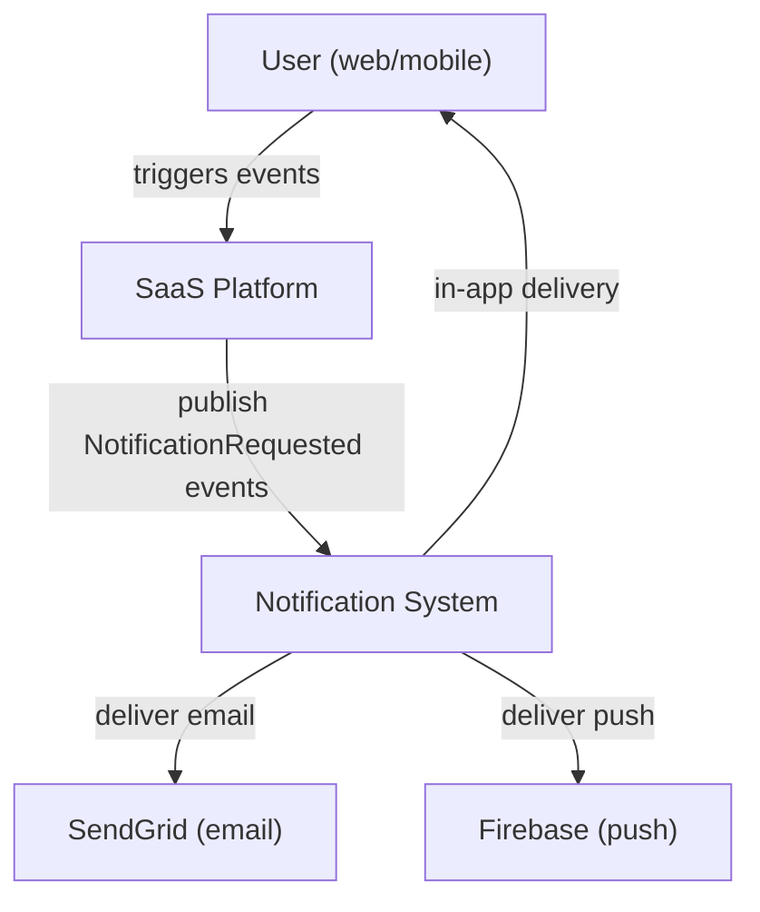
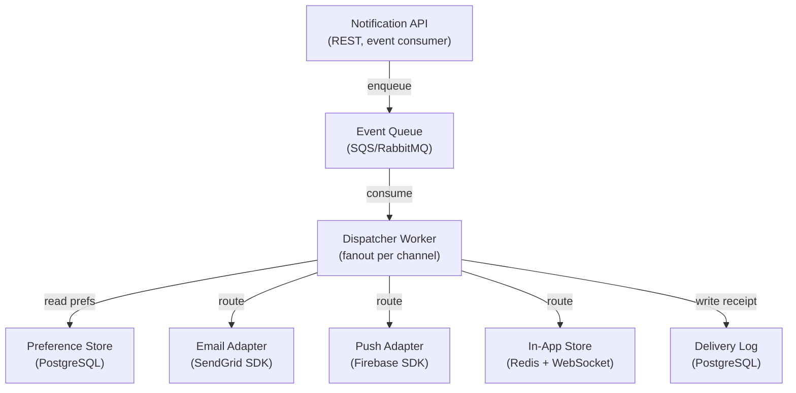
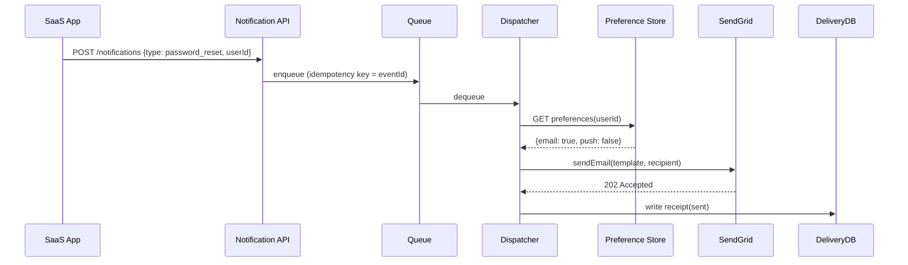

# Test: system-design skill structure

Scenario: Checking that the system-design skill enforces quantified requirements, a mandatory assumption ledger, Mermaid diagrams following the C4 model, and a confidence assessment per component.

## Prompt

Review the system-design skill definition and verify it produces complete, structured architecture documentation rather than informal diagrams.

## Criteria

- [ ] PASS: Skill explicitly rejects vague non-functional requirements — requires numbers (e.g. "p95 < 200ms", "10K concurrent users") not adjectives ("fast", "scalable")
- [ ] PASS: Skill mandates a numbered assumption ledger with confidence rating and validation method for each assumption
- [ ] PASS: Skill requires an options analysis for every significant design decision, with at least two options and a rationale for the chosen one
- [ ] PASS: Skill requires Mermaid diagrams — specifically component and sequence diagrams — as mandatory output elements
- [ ] PASS: Skill describes the C4 model levels (Context, Container, Component) and requires at minimum Level 1 and Level 2 diagrams
- [ ] PASS: Skill requires a confidence assessment table per component with a rule that components below 60% confidence must have a spike planned
- [ ] PASS: Skill requires a change impact analysis (what-if scenarios) covering traffic growth, new client types, and dependency outages
- [ ] PASS: Skill lists anti-patterns including premature microservices, distributed monolith, and shared database
- [ ] PARTIAL: Skill references arc42 as the output structure standard and links to the system-design template

---
<!-- EVALUATION BELOW — regenerated by test harness -->

## Output

Given the prompt "Design a notification delivery system for a SaaS product", here is what the system-design skill would produce:

---

# System Design: Notification Delivery System

## Requirements

### Functional

- Users receive in-app, email, and push notifications for account events (password reset, billing, alerts)
- Notification preferences are configurable per user per channel
- Bulk notifications can be sent to user segments by product/marketing teams
- Notification history is viewable by users for 90 days
- Delivery receipts tracked: sent, delivered, opened, failed

### Non-Functional

| Dimension | Target |
|---|---|
| Scale | 50K active users, 500K notifications/day peak, 10 req/s steady-state |
| Latency | Transactional notifications delivered within 5 seconds p95; bulk within 5 minutes |
| Availability | 99.9% (43.8 min/month downtime budget) |
| Durability | Zero tolerance for lost transactional notifications; at-least-once delivery |
| Security | OAuth2 bearer token auth, PII in notification body encrypted at rest (AES-256), GDPR opt-out honoured |
| Cost | < $800/month infrastructure at projected scale |

## Assumptions

| # | Assumption | Impact if wrong | Confidence | Validation method |
|---|---|---|---|---|
| A1 | Email delivery via SendGrid (existing contract) | Provider switch requires template migration | High | Product confirms |
| A2 | Peak is 10x average (500K/day = ~6 req/s avg, 60 req/s peak) | Queue sizing changes | Medium | Instrument first 30 days |
| A3 | Push notifications via Firebase (iOS + Android) | Alternative SDK integration | Medium | Mobile team confirms |
| A4 | 90-day retention fits in ~50GB | Storage tier and cost change | Low | Model: 500K * 1KB * 90 days |

## Architecture

### Level 1 — Context Diagram

### Level 2 — Container Diagram

### Components

**Notification API**
- Purpose: accepts inbound notification requests (event-driven or HTTP), validates, enqueues
- API surface: `POST /notifications`, `GET /notifications/{userId}`, event consumer on `notification.requested`
- Data ownership: owns queued notification payloads; delegates delivery state to Delivery Log
- Failure mode: queue unavailable — reject with 503, caller retries. No data loss
- Scaling: stateless, horizontal

**Dispatcher Worker**
- Purpose: reads from queue, fans out to channel adapters based on user preferences
- Failure mode: adapter timeout — dead-letter queue, alerting, manual retry
- Scaling: horizontal, one partition per worker

## Data Flows

### Transactional notification (e.g. password reset)

- Consistency model: at-least-once via SQS with idempotency key dedup
- Failure handling: SG timeout → dead-letter → alert → manual retry
- Latency budget: enqueue 50ms + dequeue 100ms + send 500ms = ~650ms

## Storage Design

| Store | Type | Engine | Access pattern | Retention |
|---|---|---|---|---|
| Notification queue | Message queue | SQS (or RabbitMQ) | Write: API; Read: Dispatcher | Until consumed + 7d DLQ |
| Preferences | Relational | PostgreSQL | Read: Dispatcher per notification | Indefinite |
| Delivery log | Relational | PostgreSQL | Write: Dispatcher; Read: API history endpoint | 90 days, then archive |
| In-app cache | Key-value | Redis | Read/write: WebSocket handlers | 30-day TTL |

## Key Decisions

### Decision: Message broker selection

| Criterion | SQS (managed) | RabbitMQ (self-hosted) | Kafka |
|---|---|---|---|
| Ops overhead | Zero | Medium | High |
| Ordering | FIFO queues | Per-queue | Per-partition |
| Throughput | 3K msg/s standard | 10K msg/s | 100K+ msg/s |
| Replay | No | No | Yes |
| Team expertise | High | Low | Low |
| **Recommendation** | **Selected** | | |

**Rationale:** At 500K/day (~6 msg/s avg, 60 msg/s peak) SQS is dramatically over-provisioned — and team expertise is high, eliminating ops burden. Kafka replay capability is not needed since delivery logs provide audit history.

**Trade-off acknowledged:** No native replay. If we need to re-deliver a window of notifications, we re-query the delivery log and re-enqueue.

## Change Impact

- **Traffic 10x (5M notifications/day):** SQS and Dispatcher scale horizontally without changes. Delivery log requires partitioning by userId at ~500M rows/year — add table partitioning in year 2
- **New client type (webhook delivery):** Add a WebhookAdapter to Dispatcher. Preference Store adds a `webhook_url` column. No changes to API or queue
- **SendGrid outage:** Email Adapter returns error → dead-letter queue accumulates → alert fires. No data loss; emails delivered when SendGrid recovers. Degraded mode: in-app and push continue
- **Schema evolution:** Notification payload uses JSON blob — additive fields always safe. Breaking changes (rename/remove) require versioned consumers with dual-read
- **Team doubles:** API, Dispatcher, and each Adapter can be owned by separate teams with no shared database

## Confidence Assessment

| Component | Confidence | Reason | Risk mitigation |
|---|---|---|---|
| Notification API | High (85) | Standard REST + queue pattern, team familiar | None needed |
| Dispatcher Worker | Medium (70) | Fanout logic and idempotency at scale untested | Load test with 10x peak in staging |
| Email Adapter | High (80) | SendGrid SDK well-documented | None |
| Push Adapter | Medium (65) | Firebase APNS integration not done before | Spike week 1 — validate token registration flow |
| In-App Store (Redis+WS) | Low (45) | WebSocket at scale uncharted; Redis pub/sub behaviour under reconnect unclear | Prototype before sprint 3 |

**Spike required:** In-App Store (confidence 45 < 60 threshold) — prototype WebSocket fan-out with 1,000 simulated concurrent connections before committing to this approach.

## Risks and Mitigations

1. **At-least-once delivery creates duplicates** — mitigate with idempotency keys in Delivery Log (upsert on eventId)
2. **GDPR opt-out race condition** — preference check happens at dispatch time, not enqueue time. Late opt-out may still deliver. Mitigate with a "cancelled" state in the delivery log and suppress at adapter level
3. **SendGrid template drift** — notification body defined in SaaS app, template in SendGrid. Schema mismatch causes rendering failures. Mitigate with contract tests in CI

## Recommended ADRs

- `/architect:write-adr` — Message broker choice (SQS vs RabbitMQ vs Kafka)
- `/architect:write-adr` — At-least-once vs exactly-once delivery semantics
- `/architect:write-adr` — In-app notification delivery mechanism (WebSocket vs long-poll vs SSE)

---

## Evaluation

**Verdict:** PASS
**Score:** 8.5/9 criteria met (94%)
**Evaluated:** 2026-04-16

### Results

- [x] PASS: Skill explicitly rejects vague NFRs and requires numbers — Step 1 NFR table has explicit "Bad answer / Good answer" columns: "Fast" → "p95 < 200ms for reads", "High traffic" → "10K concurrent users, 500 req/s peak". Anti-patterns section: "Unquantified NFRs — 'fast' and 'scalable' are not requirements. Numbers or it doesn't count."
- [x] PASS: Skill mandates numbered assumption ledger with confidence and validation method — Step 2 marked "(MANDATORY)" with table columns: #, Assumption, Impact if wrong, Confidence, Validation method. Example rows use A1/A2/A3 numbering. "Flag assumptions with confidence below 'High' — these are design risks."
- [x] PASS: Skill requires options analysis with 2+ options and rationale — Step 7 "(MANDATORY for key decisions)": "For every significant design decision, present at least 2 options." Template requires a "Rationale" row and "Trade-off acknowledged" field
- [x] PASS: Skill requires Mermaid component and sequence diagrams as mandatory output — Diagrams section "(MANDATORY)": "Every system design includes at minimum: 1. Component diagram, 2. Sequence diagram — for the top 2-3 most critical workflows, 3. Data flow diagram." "Use Mermaid syntax for all diagrams."
- [x] PASS: Skill describes C4 model levels and requires Level 1 and Level 2 at minimum — C4 Model Levels section describes all three levels. "Every system design should include at least Level 1 and Level 2 diagrams. Level 3 is recommended for complex or high-risk containers."
- [x] PASS: Skill requires confidence table with <60% = spike rule — Step 9 Confidence Scoring: table with Component, Confidence, Reason, Risk mitigation columns. "Rule: Any component with confidence below 60 must have a spike or prototype planned before implementation begins."
- [x] PASS: Skill requires change impact analysis covering all three what-if scenarios — Step 8 Change Impact Mapping lists: "What if traffic 10x?", "What if a new client type is added?", and "What if a third-party dependency goes down?" — all three present, plus two additional scenarios
- [x] PASS: Skill lists anti-patterns including all three specified — Anti-Patterns section: "Premature microservices", "Distributed monolith", "Shared database" — all three present verbatim
- [~] PARTIAL: Skill references arc42 and links to system-design template — Output Structure section references arc42 with a working URL (https://arc42.org/) and links to the template via relative path (`templates/system-design.md`). Both present; PARTIAL ceiling is a test-author constraint, not a definition gap

### Notes

The skill is one of the more complete definitions in the corpus. The confidence threshold rule with its explicit 60% floor and spike consequence is well-specified. The arc42 URL is live and the template path resolves to `plugins/engineering/architect/templates/system-design.md` in the repo — the relative path is deliberate for portability. The PARTIAL ceiling on that criterion reflects the test design, not any gap in the definition.
