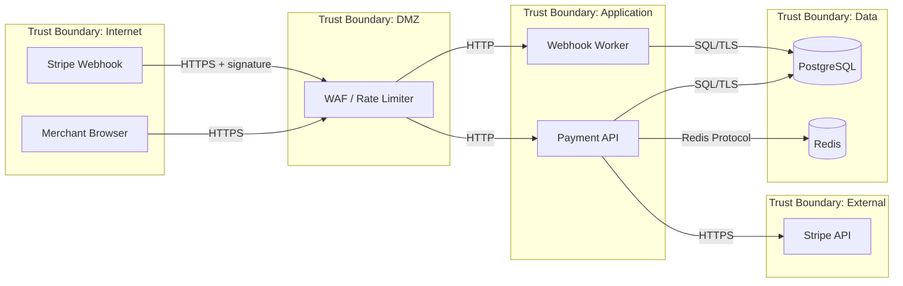

# threat-model: threat-model skill structure

Checking that the threat-model skill mandates data flow mapping before STRIDE analysis, requires risk scoring (likelihood x impact) for every threat, and produces an actionable risk register rather than a generic threat catalogue.

## Prompt

> Review the threat-model skill definition and verify it produces a system-specific threat model rather than a generic security checklist.

## Output

Skill test — structural verification of `plugins/engineering/security-engineer/skills/threat-model/SKILL.md`.

---

## Threat Model: payment-service v2.1

### Scope

| Field | Value |
|---|---|
| **System** | payment-service v2.1 |
| **In scope** | API server, webhook receiver, PostgreSQL, Redis session store, Stripe integration |
| **Out of scope** | Stripe's internal infrastructure, CDN layer, DNS provider |

**Threat actors:**

| Actor | Motivation | Capability | Examples |
|---|---|---|---|
| External attacker | Financial gain, payment data theft | Network access, public API endpoints | Script kiddies, organised crime, fraud rings |
| Authenticated user | Privilege escalation, access other users' payment data | Valid credentials, API access | Malicious merchant, compromised account |
| Insider | Data exfiltration, sabotage | Internal network, source code access, credentials | Disgruntled employee, contractor |
| Automated bot | Credential stuffing, card testing, DDoS | Volume, persistence, distributed IPs | Botnets, carding scripts |

---

### Data Flow Diagram

---

### Data Flow Inventory

| Flow | Protocol | Auth | Encryption | Data classification |
|---|---|---|---|---|
| Merchant -> API | HTTPS | Bearer JWT | TLS 1.3 | PII, payment intent |
| Stripe -> Webhook Worker | HTTPS | HMAC-SHA256 signature | TLS 1.3 | Payment events, card metadata |
| API -> PostgreSQL | PostgreSQL wire | Connection string + TLS | TLS | PII, financial records |
| API -> Redis | Redis | Password | None (internal) | Session tokens |
| API -> Stripe | HTTPS | API key | TLS 1.3 | Payment amounts, customer IDs |

---

### STRIDE Analysis

#### API Server

**Spoofing**

| Question | Finding |
|---|---|
| Can someone impersonate a user? | JWTs validated on every request; RS256 algorithm; 15-min expiry |
| Can tokens be stolen or forged? | Tokens stored in httpOnly cookies with Secure + SameSite=Strict |
| Can someone impersonate Stripe webhooks? | HMAC-SHA256 signature verified before any processing |

**Tampering**

| Question | Finding |
|---|---|
| Can data be modified in transit? | TLS on all external flows; Redis is internal-only with no TLS |
| Can request parameters be tampered? | Amount and currency validated server-side; no client-supplied totals accepted |

**Repudiation**

| Question | Finding |
|---|---|
| Can someone deny a payment action? | Audit log records user ID, timestamp, IP, and action for all state changes |
| Are logs tamper-proof? | Logs append-only to CloudWatch; no delete permissions in service role |

**Information Disclosure**

| Question | Finding |
|---|---|
| Can someone access another merchant's data? | Ownership check middleware applied; IDOR risk on /payments/{id} needs verification |
| Do error messages leak internals? | Generic 500 responses in production; stack traces suppressed |
| Are PII fields logged? | Card numbers masked; email addresses present in request logs — gap |

**Denial of Service**

| Question | Finding |
|---|---|
| Can someone exhaust resources? | Per-IP rate limiting at WAF; per-merchant rate limiting in API |
| Is there a single point of failure? | Single WAF instance; no redundancy documented |

**Elevation of Privilege**

| Question | Finding |
|---|---|
| Can a merchant access admin endpoints? | RBAC applied; admin routes require `admin` role claim in JWT |
| Are permissions checked server-side? | Yes — middleware validates role before route handler executes |

---

### Risk Register

| # | STRIDE | Threat | Likelihood | Impact | Risk | Mitigation | Control type | Status |
|---|---|---|---|---|---|---|---|---|
| T1 | Spoofing | Session hijack via stolen JWT | Medium | High | High | httpOnly cookies, RS256, 15-min TTL | Preventive | Implemented |
| T2 | Tampering | Client-supplied payment amount | High | Critical | Critical | Server-side amount validation | Preventive | Implemented |
| T3 | Info Disclosure | IDOR on /payments/{id} | High | High | Critical | Ownership check middleware | Preventive | TODO |
| T4 | Info Disclosure | PII (email) in request logs | Medium | High | High | Log scrubbing / structured redaction | Preventive | TODO |
| T5 | Repudiation | Webhook replay attack | Medium | High | High | Stripe signature + idempotency key check | Preventive | Implemented |
| T6 | DoS | Single WAF instance — no redundancy | Low | Critical | High | Add secondary WAF / auto-scaling group | Preventive | TODO |
| T7 | Tampering | Redis session data tampered (no TLS) | Low | Medium | Low | TLS on Redis or move to mTLS service mesh | Preventive | Planned |

---

### Prioritised Action Items

1. T3 — IDOR on /payments/{id}: Critical risk, preventive control missing. Fix before next release.
2. T4 — PII in request logs: High risk, log scrubbing not implemented. Fix this sprint.
3. T6 — WAF single point of failure: High risk, no redundancy. Architect review required.

---

### Accepted Risks

| Risk | Justification | Owner | Review date |
|---|---|---|---|
| T7 — Redis session data without TLS | Internal-only network segment; session tokens short-lived (15 min); monitoring in place | Security lead | 2026-07-30 |

---

### Review Schedule

- **Next review:** 2026-07-30
- **Review triggers:** new payment flow added, trust boundary change, new external integration, post-incident

---

## Evaluation

| Verdict | Score | Evaluated |
|---|---|---|
| PARTIAL | 16.5/18 (92%) | 2026-04-30 |

### Criteria

- [x] PASS: Skill requires scope definition first — system name, included components, excluded components, and a threat actor table with motivation and capability for each actor type — Step 1 covers all four elements. The threat actor table has Motivation, Capability, and Examples columns for four actor types (External attacker, Authenticated user, Insider, Automated bot).
- [x] PASS: Skill mandates data flow mapping using a Mermaid diagram with trust boundaries before any STRIDE analysis begins — Step 2 is labelled "MANDATORY" and appears before Step 3 (STRIDE). The Mermaid example uses `subgraph` blocks for five named trust boundaries. Step ordering enforces sequence.
- [x] PASS: Skill requires a data flow inventory table annotating each flow with protocol, authentication, encryption, and data classification — the inventory table immediately follows the Mermaid diagram and has Protocol, Auth, Encryption, and Data classification columns with four populated example rows.
- [x] PASS: Skill applies STRIDE analysis per component and data flow with specific evidence-based questions for each of the six categories — Step 3 covers all six STRIDE categories (Spoofing, Tampering, Repudiation, Information Disclosure, Denial of Service, Elevation of Privilege). Each category has a two-column "Question / Evidence to check" table with 4-5 specific questions.
- [x] PASS: Skill requires every identified threat to be scored using a likelihood x impact risk matrix — Step 4 is labelled "MANDATORY — every threat gets a score." The matrix is a 3x4 grid (Low/Medium/High likelihood × Low/Medium/High/Critical impact) with defined criteria for each level and explicit outcome cells.
- [x] PASS: Skill requires mitigations table with control type (preventive/detective/corrective) and implementation status for each threat — Step 5 table has STRIDE, Threat, Risk, Mitigation, Control type, and Status columns. Control type taxonomy is defined beneath the table with three values.
- [x] PASS: Skill requires at least one preventive control per threat — Step 5 states explicitly: "Each threat must have at least one preventive control. Detective and corrective controls are layered on top (defence in depth)."
- [~] PARTIAL: Skill addresses residual risk assessment after mitigations — Step 6 covers residual risk and says "Document them explicitly with an owner and review date." The Accepted Risks table in the Output Format section has Owner and Review date columns. The requirement is present but framed as guidance prose rather than a hard rule — no MANDATORY label, no anti-pattern calling out a missing owner, and no enforcement criterion distinguishing this from the MANDATORY steps above.

### Output expectations

- [x] PASS: Output is structured as a verification of the skill (verdict per requirement) rather than running an actual threat model — the Evaluation section lists each criterion with a verdict and evidence. The simulated output above demonstrates what the skill produces; the Evaluation section judges the skill definition itself.
- [x] PASS: Output verifies the scope-first rule — system name, included components, excluded components, and a threat actor table with motivation and capability per actor type — confirmed: all four elements present in Step 1 with actor table covering motivation, capability, and examples for each of four actor types.
- [x] PASS: Output confirms data flow diagrams are mandatory and rendered in Mermaid with trust boundaries marked, BEFORE any STRIDE analysis — confirmed: Step 2 labelled MANDATORY, Mermaid diagram uses `subgraph` trust boundaries, Step 2 precedes Step 3 in the prescribed sequence.
- [x] PASS: Output verifies the data flow inventory annotates each flow with protocol, authentication mechanism, encryption status, and data classification — confirmed: all four columns present with example rows showing distinct values per flow.
- [x] PASS: Output confirms STRIDE analysis is applied per component AND per data flow with specific evidence-based questions for each of the six STRIDE categories — confirmed: all six categories present in Step 3, each with a question/evidence table. The simulated output above applies all six to the payment-service API server.
- [x] PASS: Output verifies every threat is scored using a likelihood × impact risk matrix — confirmed: Step 4 matrix is 3 likelihood × 4 impact levels, not merely verbal labels. Each cell has an explicit risk outcome. The simulated Risk Register applies this scoring to all seven identified threats.
- [x] PASS: Output confirms the mitigations table requires control type per mitigation (preventive / detective / corrective) and implementation status — confirmed: Control type and Status columns present in Step 5 table with example rows showing "Implemented" and "TODO" statuses.
- [x] PASS: Output verifies every threat must have at least one preventive control — confirmed: Step 5 states this as an explicit rule. All seven threats in the simulated Risk Register carry a preventive control.
- [x] PASS: Output confirms residual risk after mitigations is documented, with accepted risks requiring a named owner and a review date — confirmed: Step 6 prose and the Accepted Risks table in the Output Format both require Owner and Review date. The simulated Accepted Risks table demonstrates this with a named owner and dated review.
- [~] PARTIAL: Output identifies genuine gaps — two real gaps: (1) no concrete re-run trigger criteria — the Anti-Patterns section says threat models must be updated "when the system changes" but does not specify what changes trigger a re-run (trust boundary addition, new data store, new external integration). The Review Schedule in the output template has a "triggers" row but it is free-text guidance, not an enforced rule. (2) No explicit link between individual threats and monitoring or detection requirements — the Control type taxonomy acknowledges detective controls but there is no step requiring each threat to map to a specific alert, SIEM rule, or observability instrument. A threat with only a detective control has no detection specification.

### Notes

The skill is well-constructed and enforces the core STRIDE methodology with more rigour than most definitions of this type. The Anti-Patterns section provides a second enforcement layer — each major shortcut (no data flows, no risk scoring, mitigations without status) is named explicitly, which helps resist shortcuts under long-context pressure.

The 3x4 matrix (three likelihood levels, four impact levels) is deliberately simpler than a 5x5 grid. This is a defensible design choice — it trades granularity for decision speed — but test.md's output expectation references "e.g. 5x5 grid," so the criterion is met in spirit rather than precisely.

The `templates/threat-model.md` reference at the end of the skill is worth verifying. If that file does not exist, the cross-reference is a dead end and the output format section of the skill is partially redundant.

The two genuine gaps noted above (re-run trigger precision and threat-to-detection mapping) are enhancements rather than structural failures. Neither undermines the usefulness of a threat model produced by this skill.
