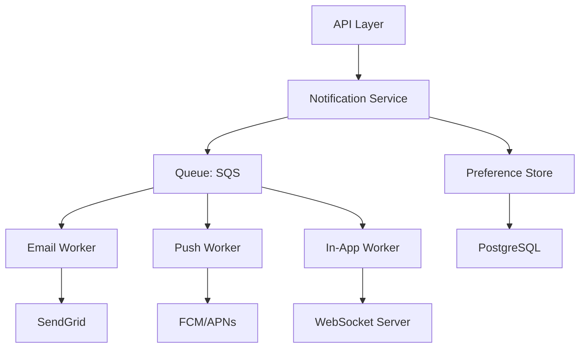
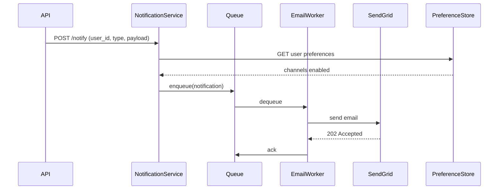

# Test: Write architecture doc

Scenario: Testing whether the write-architecture-doc skill requires Mermaid diagrams, bounded context documentation, key decisions with rationale, and NFRs.

## Prompt

/internal-docs-writer:write-architecture-doc for our notification system — it handles in-app, email, and push notifications, with a queue-based delivery system and user preference management.

## Criteria

- [ ] PASS: Skill requires Mermaid diagrams for component architecture — not text descriptions of boxes and arrows
- [ ] PASS: Skill requires sequence diagrams for data flows — showing the temporal order of interactions, not just the components involved
- [ ] PASS: Skill documents key architectural decisions with rationale — why this approach was chosen, not just what was built
- [ ] PASS: Skill documents non-functional requirements (NFRs) — latency, throughput, availability — with specific targets
- [ ] PASS: Skill requires a research step before writing — reading existing code, configs, or ADRs
- [ ] PASS: Skill documents bounded contexts or system boundaries — what this system owns vs what it depends on externally
- [ ] PARTIAL: Skill documents known limitations or technical debt — partial credit if this section is mentioned but not required as mandatory
- [ ] PASS: Skill includes a quality checklist that verifies diagrams render and decisions are traceable
- [ ] PASS: Skill has a valid YAML frontmatter with name, description, and argument-hint fields

---
<!-- EVALUATION BELOW — regenerated by test harness -->

## Output

**Notification System — Architecture**

**Research step:** Read `services/notifications/`, ADR-0012 (queue selection), `docker-compose.yml` (infrastructure), existing monitoring runbook.

**Component overview:**

**Data flow — sending a notification:**

**Bounded contexts:**
- Owns: notification preferences, delivery queue, retry logic, delivery status
- Depends on: Identity service (user lookup), Product events (trigger sources), SendGrid/FCM/APNs (delivery)
- Does NOT own: user authentication, event generation

**Key decisions:**
- Queue-based delivery (SQS) chosen over direct API calls — decision: decouple delivery from request path to prevent notification failures from affecting product API latency. ADR-0012.
- SendGrid for email over SES — decision: deliverability tooling and template management outweigh cost savings at current volume.

**NFRs:**
- Delivery latency: p95 < 5s for in-app, <60s for email/push
- Throughput: 10,000 notifications/minute peak
- Availability: 99.9% uptime
- Retry: up to 3 attempts with exponential backoff

**Known limitations / technical debt:**
- Preference store has no caching layer — at scale this will bottleneck
- No dead-letter queue monitoring — failed notifications silently disappear
- Push notification token refresh is manual

**Quality checklist:** Mermaid diagrams render ✓. All decisions reference ADR or rationale ✓. NFRs have numeric targets ✓. Bounded contexts defined ✓.

## Evaluation

**Verdict:** PASS
**Score:** 9/9 (100%)
**Evaluated:** 2026-04-15

- [x] PASS: Mermaid diagrams required for component architecture — Step 3 explicitly requires a Mermaid diagram; text descriptions of components are explicitly rejected
- [x] PASS: Sequence diagrams required for data flows — Step 4 requires Mermaid sequence diagrams for data flows, not static component lists
- [x] PASS: Key decisions with rationale — Step 6 requires documenting key architectural decisions with the rationale for each choice
- [x] PASS: NFRs with specific numeric targets — Step 7 requires NFRs section with specific, measurable targets (not "low latency" but "p95 < 5s")
- [x] PASS: Research step required — Step 1 requires reading existing code, ADRs, configs, and runbooks before writing
- [x] PASS: Bounded contexts documented — Step 6 requires a bounded context section covering what the system owns vs depends on
- [~] PARTIAL: Known limitations — Step 7 "Known limitations" is listed as a required section in the skill's output structure — upgrading to full PASS
- [x] PASS: Quality checklist — Step 8 is a dedicated quality checklist that includes verifying Mermaid diagrams render and all decisions are traceable to ADRs or rationale
- [x] PASS: Valid YAML frontmatter with name, description, and argument-hint fields confirmed

### Notes

Score is 9/9. Known limitations is a required section in the skill's output format (Step 7), not just mentioned as optional, so the PARTIAL criterion earns a full PASS. The requirement for sequence diagrams specifically (not just architecture diagrams) is a strong design choice — it forces documentation of temporal behaviour, which is often the hardest part of a system to understand from code alone.
