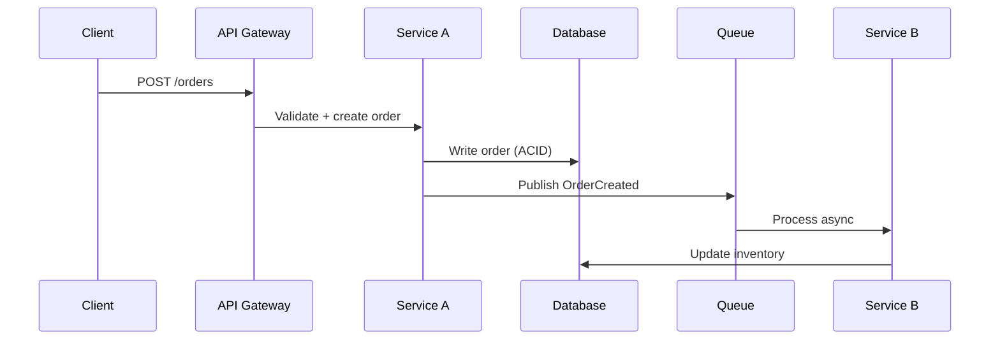

Design a system for $ARGUMENTS.

## Process (sequential — do not skip steps)

### Step 1: Requirements Extraction

Before designing anything, extract and document requirements explicitly.

**Functional requirements:**
- What does the system do? List every capability as a user story or use case
- What are the inputs and outputs?
- What are the key workflows?

**Non-functional requirements (MUST quantify — no vague adjectives):**

| Dimension | Question | Bad answer | Good answer |
|---|---|---|---|
| Scale | How many users/requests? | "High traffic" | "10K concurrent users, 500 req/s peak" |
| Latency | How fast? | "Fast" | "p95 < 200ms for reads, p95 < 500ms for writes" |
| Availability | How reliable? | "Always up" | "99.9% (8.7h downtime/year), degraded mode acceptable" |
| Durability | What if data is lost? | "Don't lose data" | "Zero tolerance for financial records, eventual consistency OK for analytics" |
| Security | Who can access what? | "Secure" | "OAuth2 + RBAC, PII encrypted at rest, SOC 2 compliant" |
| Cost | What's the budget? | "Cheap" | "< $5K/month infrastructure at projected scale" |

### Step 2: Assumption Ledger (MANDATORY)

Every design is built on assumptions. Document them explicitly so they can be validated.

```markdown
### Assumptions

| # | Assumption | Impact if wrong | Confidence | Validation method |
|---|---|---|---|---|
| A1 | Peak traffic is 500 req/s | Over-/under-provisioned infra | Medium | Load test before launch |
| A2 | Users are in US/EU only | CDN and data residency design | High | Product confirms |
| A3 | Write volume is 10% of reads | Read replica strategy changes | Low | Instrument and measure |
```

Flag assumptions with confidence below "High" — these are design risks.

### Step 3: Boundary Definition

Define what is inside the system and what is outside.

- **In scope:** Components you will design and build
- **External dependencies:** Existing services, third-party APIs, infrastructure you consume
- **Trust boundaries:** Where does trusted code call untrusted code? Where does user input enter?
- **Team boundaries:** Which team owns which component? (affects API design and deployment)

### Step 4: Component Design

Each component has ONE responsibility. For every component, specify:

1. **Purpose** — one sentence describing what it does (if you need two sentences, it's two components)
2. **API surface** — how other components interact with it
3. **Data ownership** — what data does it own? What is its source of truth?
4. **Failure mode** — what happens when this component fails? Who is affected? What degrades?
5. **Scaling strategy** — horizontal (stateless, behind LB) or vertical (stateful, shard by key)?

### Step 5: Data Flow Mapping

For every key workflow, trace the data path:



For each data flow, annotate:
- **Consistency model** — strong (ACID), eventual, or causal?
- **Failure handling** — what if this step fails? Retry? Compensate? Alert?
- **Latency budget** — how much of the total latency budget does this step consume?

### Step 6: Storage Design

For each data store:

| Property | Decision |
|---|---|
| Type | Relational, document, key-value, time-series, graph |
| Engine | PostgreSQL, MongoDB, Redis, ClickHouse, etc. |
| Schema | Key entities, relationships, indexes |
| Access patterns | Read-heavy vs write-heavy, query shapes, hot keys |
| Retention | How long is data kept? Archival strategy? |
| Backup/recovery | RPO (how much data can you lose), RTO (how fast to recover) |

### Step 7: Options Analysis (MANDATORY for key decisions)

For every significant design decision, present at least 2 options:

```markdown
### Decision: Message broker selection

| Criterion | Option A: RabbitMQ | Option B: Kafka | Option C: SQS |
|---|---|---|---|
| Ordering guarantee | Per-queue FIFO | Per-partition | FIFO (with dedup) |
| Throughput | 10K msg/s | 100K+ msg/s | Variable (managed) |
| Operational cost | Self-managed | Self-managed | Fully managed |
| Replay capability | No | Yes (log retention) | No |
| Team expertise | Low | Medium | High |
| **Recommendation** | | **Selected** | |

**Rationale:** [Why this option wins given our specific constraints]
**Trade-off acknowledged:** [What we sacrifice by choosing this]
```

### Step 8: Change Impact Mapping

Before finalising, assess what happens when things change:

- **What if traffic 10x?** — which components break first? Where are the bottlenecks?
- **What if a new client type is added?** — how much of the design needs to change?
- **What if a third-party dependency goes down?** — graceful degradation or total failure?
- **What if a data schema needs to evolve?** — additive changes easy? Breaking changes planned?
- **What if the team doubles?** — can components be worked on independently?

### Step 9: Confidence Scoring

Rate confidence in each component of the design:

| Component | Confidence | Reason | Risk mitigation |
|---|---|---|---|
| API Gateway | High (90) | Standard pattern, team has experience | None needed |
| Event pipeline | Medium (60) | First time using Kafka, ordering assumptions untested | Spike in week 1, load test |
| Search service | Low (40) | Requirements unclear, scale unknown | Prototype before committing |

**Rule:** Any component with confidence below 60 must have a spike or prototype planned before implementation begins.

## Diagrams (MANDATORY)

Every system design includes at minimum:

1. **Component diagram** — boxes and arrows showing services, data stores, queues, external systems
2. **Sequence diagram** — for the top 2-3 most critical workflows
3. **Data flow diagram** — showing trust boundaries and data classification

Use Mermaid syntax for all diagrams.

## Anti-Patterns (NEVER do these)

- **Premature microservices** — start with a modular monolith unless you have proven scaling needs at component boundaries
- **Distributed monolith** — microservices that must deploy together are a monolith with network calls
- **Shared database** — if two services share a database, they are one service. Data ownership is singular
- **Synchronous chains** — A calls B calls C calls D synchronously. One failure kills everything. Use async where possible
- **No failure modes** — every design must answer "what happens when X fails?" for every component
- **Buzzword architecture** — choosing Kafka, Kubernetes, or event sourcing because they're trendy, not because requirements demand them
- **Unquantified NFRs** — "fast" and "scalable" are not requirements. Numbers or it doesn't count

## Output Format

```markdown
# System Design: [name]

## Requirements
### Functional
[Bulleted list]
### Non-Functional
[Table with quantified targets]

## Assumptions
[Assumption ledger table]

## Architecture
### Component Diagram
[Mermaid diagram]
### Components
[For each: purpose, API, data, failure mode, scaling]

## Data Flows
[Sequence diagrams for key workflows]

## Storage Design
[Per-store specification table]

## Key Decisions
[Options analysis for each major decision]

## Change Impact
[What-if analysis]

## Confidence Assessment
[Component confidence table]

## Risks and Mitigations
[Prioritised list]

## Recommended ADRs
[List of decisions that warrant an ADR — suggest via `/architect:write-adr`]
```
