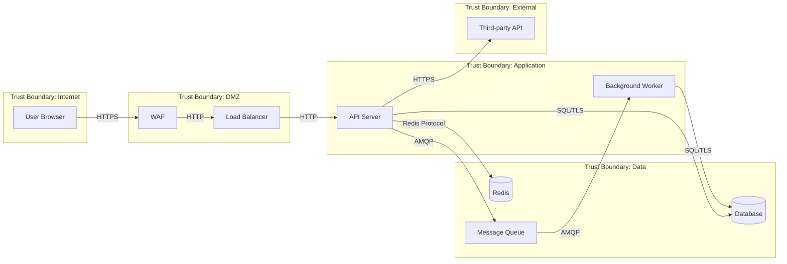

Create a threat model for $ARGUMENTS using STRIDE.

## Process (sequential — do not skip steps)

### Step 1: Scope Definition

Define exactly what is being modelled. A threat model without boundaries is useless.

1. **System name and version** — what specific system or feature?
2. **What is included** — which components, endpoints, data stores, and workflows?
3. **What is excluded** — what is explicitly out of scope? (third-party infrastructure, upstream services you don't control)
4. **Threat actors** — who would attack this system?

| Actor | Motivation | Capability | Examples |
|---|---|---|---|
| **External attacker** | Financial gain, data theft | Network access, public APIs, social engineering | Script kiddies, organised crime |
| **Authenticated user** | Privilege escalation, data access | Valid credentials, API access | Malicious user, compromised account |
| **Insider** | Data exfiltration, sabotage | Internal network, source code, credentials | Disgruntled employee, contractor |
| **Automated bot** | Credential stuffing, scraping, DDoS | Volume, persistence | Botnets, scrapers |

### Step 2: Data Flow Mapping (MANDATORY)

Map every path data takes through the system. This is the foundation of the threat model.



For each data flow, document:

| Flow | Protocol | Auth | Encryption | Data classification |
|---|---|---|---|---|
| User -> API | HTTPS | Bearer token | TLS 1.3 | PII, credentials |
| API -> Database | PostgreSQL | Connection string | TLS | PII, financial |
| API -> Redis | Redis | Password | None (internal) | Session data |
| API -> Third-party | HTTPS | API key | TLS 1.3 | Business data |

**Trust boundaries** are the critical concept. Every time data crosses a trust boundary, it must be validated, authenticated, and potentially encrypted.

### Step 3: STRIDE Analysis (per component and data flow)

For EACH component and EACH data flow crossing a trust boundary, systematically evaluate all six STRIDE categories:

#### Spoofing (Identity)

| Question | Evidence to check |
|---|---|
| Can someone impersonate a user? | Authentication mechanism, token validation, session management |
| Can someone impersonate a service? | mTLS, API key rotation, service mesh identity |
| Can tokens be stolen or forged? | Token storage (httpOnly cookies vs localStorage), JWT algorithm (RS256 not HS256), expiry |
| Can sessions be hijacked? | Session fixation protections, cookie flags (Secure, SameSite) |

#### Tampering (Integrity)

| Question | Evidence to check |
|---|---|
| Can data be modified in transit? | TLS on all connections, certificate pinning for mobile |
| Can data be modified at rest? | Database access controls, encryption, audit logging |
| Can request parameters be tampered? | Input validation, allowlists, signed requests |
| Can someone modify audit logs? | Append-only log storage, separate log credentials |

#### Repudiation (Accountability)

| Question | Evidence to check |
|---|---|
| Can someone deny performing an action? | Audit logging with who/what/when/where |
| Are audit logs tamper-proof? | Write-once storage, separate access controls |
| Are significant actions logged? | CRUD operations, auth events, permission changes |
| Can log timestamps be trusted? | Centralised time source, log integrity verification |

#### Information Disclosure (Confidentiality)

| Question | Evidence to check |
|---|---|
| Can someone access data they shouldn't? | Authorisation checks on every endpoint, IDOR testing |
| Do error messages leak internal details? | Stack traces, file paths, SQL queries in responses |
| Do logs contain sensitive data? | PII, passwords, tokens, credit card numbers in logs |
| Is data encrypted at rest? | Database encryption, file encryption, key management |
| Can someone enumerate resources? | Sequential IDs (use UUIDs), rate limiting on list endpoints |

#### Denial of Service (Availability)

| Question | Evidence to check |
|---|---|
| Can someone exhaust resources? | Rate limiting, request size limits, connection limits |
| Are there algorithmic complexity attacks? | Regex DoS (ReDoS), hash collision, XML bomb |
| Can a single user monopolise the system? | Per-user quotas, fair queuing |
| Is there single-point-of-failure? | Redundancy, health checks, auto-scaling |

#### Elevation of Privilege (Authorisation)

| Question | Evidence to check |
|---|---|
| Can a user access admin functions? | Role-based access control, endpoint-level auth |
| Can someone bypass authorisation? | Mass assignment, parameter pollution, JWT manipulation |
| Are permissions checked server-side? | Not just UI-level checks — server validates every request |
| Can someone escalate through API composition? | Chaining allowed operations to achieve disallowed outcomes |

### Step 4: Risk Assessment (MANDATORY — every threat gets a score)

For each identified threat, assess risk as likelihood x impact:

**Likelihood:**

| Level | Criteria |
|---|---|
| **High** | Easily exploitable, tools readily available, no authentication required |
| **Medium** | Requires some skill or access, but achievable |
| **Low** | Requires significant expertise, insider access, or unlikely conditions |

**Impact:**

| Level | Criteria |
|---|---|
| **Critical** | Data breach, financial loss, complete service compromise, regulatory violation |
| **High** | Significant data exposure, major feature compromise, reputational damage |
| **Medium** | Limited data exposure, feature degradation, contained impact |
| **Low** | Minimal impact, no data exposure, cosmetic or informational |

**Risk matrix:**

|  | Impact: Low | Impact: Medium | Impact: High | Impact: Critical |
|---|---|---|---|---|
| **Likelihood: High** | Medium | High | Critical | Critical |
| **Likelihood: Medium** | Low | Medium | High | Critical |
| **Likelihood: Low** | Low | Low | Medium | High |

### Step 5: Mitigations

For each threat, document the mitigation:

| # | STRIDE | Threat | Risk | Mitigation | Control type | Status |
|---|---|---|---|---|---|---|
| T1 | Spoofing | Token theft via XSS | High | httpOnly cookies, CSP headers | Preventive | Implemented |
| T2 | Tampering | SQL injection | Critical | Parameterised queries, ORM | Preventive | Implemented |
| T3 | Info Disclosure | PII in logs | Medium | Log scrubbing, structured logging | Detective | TODO |
| T4 | EoP | IDOR on /users/{id} | High | Ownership check middleware | Preventive | TODO |

**Control types:**
- **Preventive** — stops the attack (input validation, encryption, auth)
- **Detective** — detects the attack (monitoring, logging, alerting)
- **Corrective** — responds to the attack (incident response, auto-remediation)

Each threat must have at least one preventive control. Detective and corrective controls are layered on top (defence in depth).

### Step 6: Residual Risk Assessment

After mitigations, reassess:
- What risk remains even with mitigations in place?
- Are there accepted risks? (Document them explicitly with an owner and review date)
- What would change the risk profile? (New features, scale changes, regulatory changes)

## Anti-Patterns (NEVER do these)

- **Threat modelling without data flows** — if you haven't mapped data flows, you haven't threat modelled. You've just made a list of worries
- **Generic threats without specifics** — "SQL injection is a risk" without identifying WHERE in YOUR system it's a risk is useless
- **No risk scoring** — every threat needs likelihood and impact. Without scoring, everything is equally important (which means nothing is)
- **Mitigations without status** — a mitigation that says "use encryption" without noting whether it's implemented or TODO is incomplete
- **One-time exercise** — threat models must be updated when the system changes. If the architecture changes, the threat model changes
- **Ignoring insider threats** — most threat models only consider external attackers. Insiders are often the highest-capability threat actor

## Output Format

```markdown
# Threat Model: [System Name]

## Scope
- **System:** [name and version]
- **In scope:** [components]
- **Out of scope:** [exclusions]
- **Threat actors:** [table]

## Data Flow Diagram
[Mermaid diagram with trust boundaries]

## Data Flow Inventory
| Flow | Protocol | Auth | Encryption | Classification |
|---|---|---|---|---|

## STRIDE Analysis
### [Component/Flow Name]
[Per-STRIDE-category analysis with evidence]

## Risk Register
| # | STRIDE | Threat | Likelihood | Impact | Risk | Mitigation | Status |
|---|---|---|---|---|---|---|---|

## Prioritised Action Items
1. [Critical risk — immediate action required]
2. [High risk — address this sprint]
3. [Medium risk — planned for next iteration]

## Accepted Risks
| Risk | Justification | Owner | Review date |
|---|---|---|---|

## Review Schedule
- Next review: [date or trigger event]
- Review triggers: [new features, architecture changes, incidents]
```
