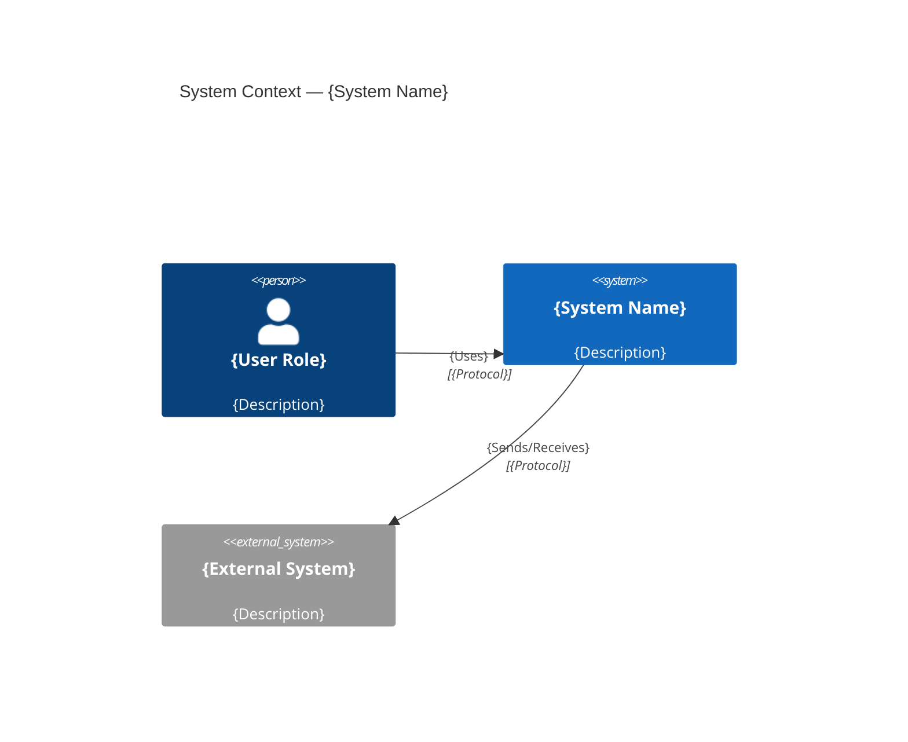
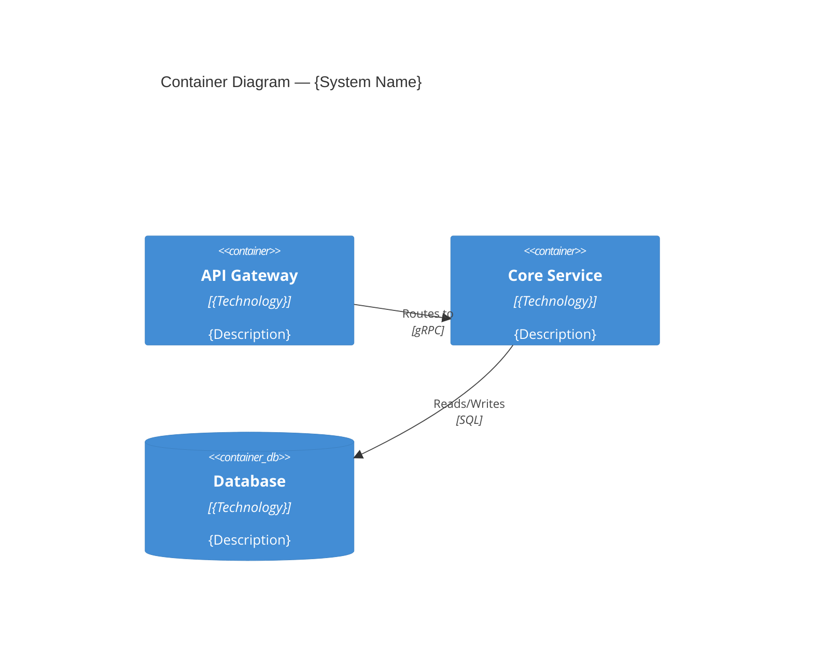
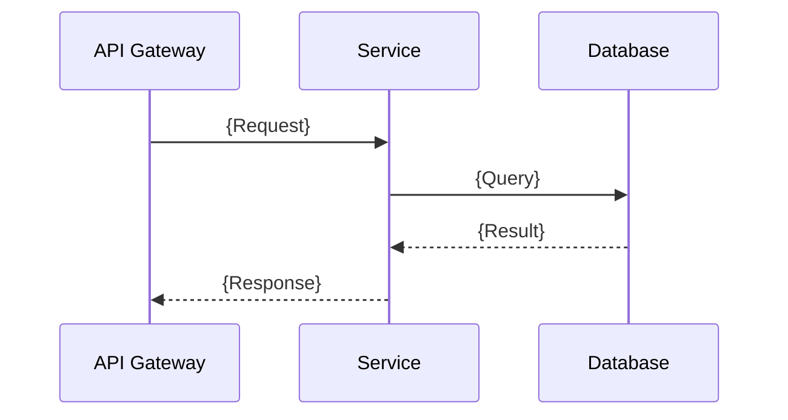

# System Design Document — {System Name}

> arc42-aligned | Version {0.1} | {Date} | Status: {Draft/Review/Approved}

## 1. Introduction & Goals

{Brief description of the system's purpose and key functional requirements.}

| Priority | Quality Attribute | Scenario |
|----------|-------------------|----------|
| 1 | {e.g. Availability} | {System remains available 99.9% during peak hours} |
| 2 | {e.g. Performance} | {API responds within 200ms at p95 under normal load} |

| Stakeholder Role | Name | Expectations |
|------------------|------|-------------|
| {Product Owner} | {Name} | {Expectations} |

## 2. Constraints

| Type | Constraint | Rationale |
|------|-----------|-----------|
| Technical | {e.g. Must run on AWS} | {Existing cloud contract} |
| Organisational | {e.g. Team of 4 backend engineers} | {Current headcount} |
| Convention | {e.g. RESTful APIs, OpenAPI 3.1} | {Company standard} |

## 3. Context & Scope (C4 Level 1)

| Interface | System | Protocol | Direction | Purpose |
|-----------|--------|----------|-----------|---------|
| {Name} | {External system} | {REST/gRPC/Event} | {In/Out/Both} | {Description} |

## 4. Solution Strategy

| Decision Area | Approach | Rationale |
|--------------|----------|-----------|
| Architecture style | {e.g. Microservices} | {Reason} |
| Primary language | {e.g. Go} | {Reason} |
| Data storage | {e.g. PostgreSQL + Redis} | {Reason} |

## 5. Building Block View (C4 Level 2-3)

| Component | Responsibility | Technology | Interfaces |
|-----------|---------------|------------|------------|
| {Name} | {What it does} | {Stack} | {APIs exposed/consumed} |

## 6. Runtime View

{Add sequence diagrams for other critical scenarios.}

## 7. Deployment View

| Environment | Infrastructure | Region | Notes |
|-------------|---------------|--------|-------|
| Production | {e.g. EKS cluster} | {e.g. eu-west-1} | {Auto-scaling, multi-AZ} |
| Staging | {e.g. EKS cluster} | {e.g. eu-west-1} | {Mirrors prod topology} |

## 8. Cross-Cutting Concepts

| Concern | Approach | Details |
|---------|----------|---------|
| Authentication | {e.g. OAuth 2.0 + JWT} | {Token lifetime, refresh strategy} |
| Authorisation | {e.g. RBAC} | {Role definitions, enforcement point} |
| Logging | {e.g. Structured JSON to stdout} | {Correlation IDs, PII redaction} |
| Error handling | {e.g. RFC 7807 Problem Details} | {Error classification strategy} |

## 9. Architecture Decisions

Decisions recorded as ADRs in `docs/adr/`.

| ADR | Title | Status | Date |
|-----|-------|--------|------|
| ADR-001 | {Title} | {Accepted/Superseded/Deprecated} | {Date} |

## 10. Quality Requirements

| ID | Quality Attribute | Scenario | Measure | Target |
|----|-------------------|----------|---------|--------|
| QS-01 | {e.g. Latency} | {Under 500 RPS} | p95 latency | < 200ms |
| QS-02 | {e.g. Availability} | {Single-node failure} | Uptime | 99.9% |

## 11. Risks & Technical Debt

| ID | Risk | Likelihood | Impact | Mitigation |
|----|------|-----------|--------|-----------|
| R-01 | {Description} | {High/Med/Low} | {High/Med/Low} | {Plan} |

| Tech Debt Item | Impact | Effort | Priority |
|---------------|--------|--------|----------|
| {Description} | {Effect} | {T-shirt size} | {High/Med/Low} |

## 12. Glossary

| Term | Definition |
|------|-----------|
| {Domain term} | {Plain-language definition} |
