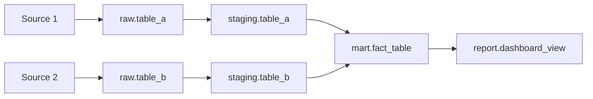

# Data Lineage — {{pipeline_name}}

| Field       | Value              |
|-------------|--------------------|
| Owner       | {{owner}}          |
| Last updated| {{date}}           |
| Status      | Active / Deprecated / In Development |

## Source systems

| # | Source name | Type | Connection | Schema / Topic | Freshness | Ingestion method |
|---|-----------|------|------------|----------------|-----------|------------------|
| 1 | {{source1}} | {{DB/API/Stream/File}} | {{conn_string_ref}} | {{schema.table or topic}} | {{e.g. near-real-time}} | {{CDC/batch/stream}} |
| 2 | {{source2}} | {{type}} | {{conn}} | {{schema}} | {{freshness}} | {{method}} |

## Transformation graph

> Replace the above with the actual DAG for this pipeline.

## Target tables

| Target | Schema | Grain | Partitioned by | Retention |
|--------|--------|-------|---------------|-----------|
| {{target1}} | {{schema}} | {{e.g. one row per event}} | {{date}} | {{e.g. 90 days}} |

## Freshness SLA

| Layer   | SLA               | Measurement            |
|---------|-------------------|------------------------|
| Raw     | {{e.g. < 15 min}} | {{last_loaded_at}}     |
| Staging | {{e.g. < 30 min}} | {{dbt source freshness}} |
| Mart    | {{e.g. < 1 hour}} | {{dashboard timestamp}} |

## Data quality checks

| Stage   | Check | Tool | Severity | Action on failure |
|---------|-------|------|----------|-------------------|
| Raw     | {{e.g. row count > 0}} | {{dbt test / Great Expectations}} | {{warn/error}} | {{alert/block}} |
| Staging | {{e.g. no nulls on PK}} | {{tool}} | {{severity}} | {{action}} |
| Mart    | {{e.g. referential integrity}} | {{tool}} | {{severity}} | {{action}} |

## Failure and retry behaviour

| Scenario | Behaviour | Max retries | Backoff | Escalation |
|----------|-----------|-------------|---------|------------|
| Source unavailable | {{retry with backoff}} | {{3}} | {{exponential, 5 min base}} | {{page on-call after 3 failures}} |
| Schema drift | {{fail and alert}} | {{0}} | — | {{notify data engineering channel}} |
| Quality check failure | {{block downstream / warn}} | — | — | {{create incident ticket}} |

## Owner and alerting

| Role | Person / Team | Contact |
|------|--------------|---------|
| Pipeline owner | {{owner}} | {{slack/email}} |
| On-call | {{team}} | {{pagerduty/opsgenie}} |
| Stakeholder | {{consumer_team}} | {{slack channel}} |

## Change log

| Date | Change | Author |
|------|--------|--------|
|      |        |        |
