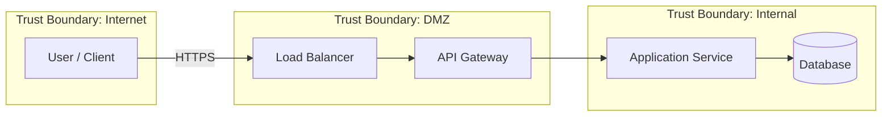

# Threat Model: [System Name]

| Field | Value |
|---|---|
| **Version** | [e.g. 1.0] |
| **Author** | [Name] |
| **Review date** | [YYYY-MM-DD] |
| **Status** | Draft / In Review / Approved |
| **Scope** | [One-sentence summary of what this model covers] |

## Scope

### Included

- [Component, endpoint, or workflow included in this model]
- [Data stores and processing pipelines in scope]

### Excluded

- [Third-party infrastructure, upstream services, or components explicitly out of scope]

### Trust Boundaries

- [Boundary 1: e.g. Internet ↔ DMZ — describe what crosses this boundary]
- [Boundary 2: e.g. DMZ ↔ Internal Network — describe what crosses this boundary]

## Threat Actors

| Actor Type | Capability | Motivation | Access Level |
|---|---|---|---|
| External attacker | [e.g. Network access, public APIs] | [e.g. Financial gain, data theft] | [e.g. Unauthenticated, internet-facing] |
| Authenticated user | [e.g. Valid credentials, API tokens] | [e.g. Privilege escalation, data access] | [e.g. Standard user role] |
| Insider | [e.g. Source code, internal network] | [e.g. Data exfiltration, sabotage] | [e.g. Employee, contractor] |
| Automated bot | [e.g. Volume, persistence, scripted attacks] | [e.g. Credential stuffing, scraping] | [e.g. Unauthenticated, rate-limited] |

## Data Flow Diagram

### Data Flow Inventory

| Flow | From | To | Protocol | Data Classification | Auth |
|---|---|---|---|---|---|
| [Flow 1] | [Source] | [Destination] | [e.g. HTTPS, gRPC] | [e.g. PII, public, internal] | [e.g. OAuth2, mTLS, none] |

## STRIDE Analysis

| Component | Threat | Description | Likelihood | Impact | Risk | Mitigation | Status |
|---|---|---|---|---|---|---|---|
| [Component] | **S** — Spoofing | [How an attacker could impersonate a legitimate entity] | [H/M/L] | [H/M/L] | [Critical/High/Medium/Low] | [Specific countermeasure] | [Open/Mitigated/Accepted] |
| [Component] | **T** — Tampering | [How data or code could be modified without authorisation] | [H/M/L] | [H/M/L] | [Critical/High/Medium/Low] | [Specific countermeasure] | [Open/Mitigated/Accepted] |
| [Component] | **R** — Repudiation | [How actions could be performed without audit trail] | [H/M/L] | [H/M/L] | [Critical/High/Medium/Low] | [Specific countermeasure] | [Open/Mitigated/Accepted] |
| [Component] | **I** — Info Disclosure | [How sensitive data could be exposed] | [H/M/L] | [H/M/L] | [Critical/High/Medium/Low] | [Specific countermeasure] | [Open/Mitigated/Accepted] |
| [Component] | **D** — Denial of Service | [How availability could be impacted] | [H/M/L] | [H/M/L] | [Critical/High/Medium/Low] | [Specific countermeasure] | [Open/Mitigated/Accepted] |
| [Component] | **E** — Elevation of Privilege | [How an attacker could gain higher access] | [H/M/L] | [H/M/L] | [Critical/High/Medium/Low] | [Specific countermeasure] | [Open/Mitigated/Accepted] |

## Risk Register

| ID | Threat | Risk Level | Mitigation | Control Type | Owner | Status |
|---|---|---|---|---|---|---|
| RISK-001 | [Threat description] | [Critical/High/Medium/Low] | [Mitigation action] | [Preventive / Detective / Corrective] | [Team or person] | [Open/In Progress/Closed] |

## Accepted Risks

| Risk | Justification | Approver | Review Date |
|---|---|---|---|
| [Accepted risk description] | [Why the team accepts this risk — e.g. low likelihood, compensating controls, cost-prohibitive to fix] | [Name and role of approver] | [YYYY-MM-DD — must be reviewed by this date] |

## Action Items

| Priority | Action | Owner | Deadline | Status |
|---|---|---|---|---|
| P1 | [Highest-priority remediation action] | [Owner] | [YYYY-MM-DD] | [Open/In Progress/Done] |
| P2 | [Second-priority action] | [Owner] | [YYYY-MM-DD] | [Open/In Progress/Done] |

## Review Schedule

| Field | Value |
|---|---|
| **Next scheduled review** | [YYYY-MM-DD] |
| **Review cadence** | [e.g. Quarterly, after each major release] |
| **Triggers for earlier review** | Architecture change, new threat intelligence, security incident, dependency upgrade, compliance audit |
